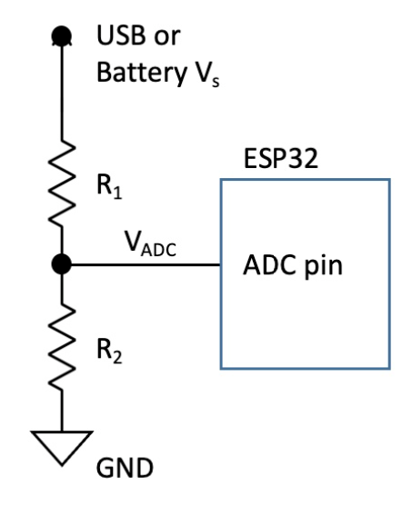
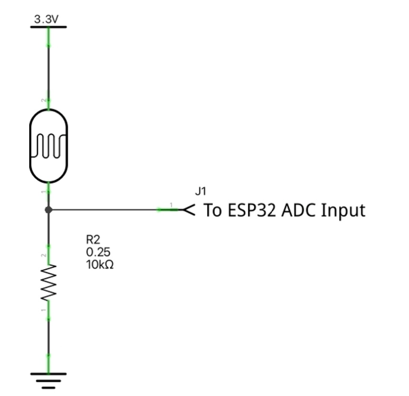
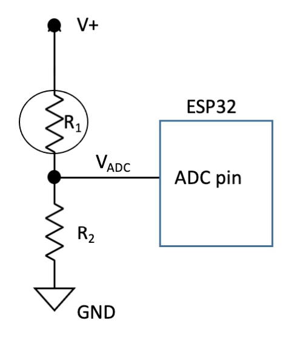
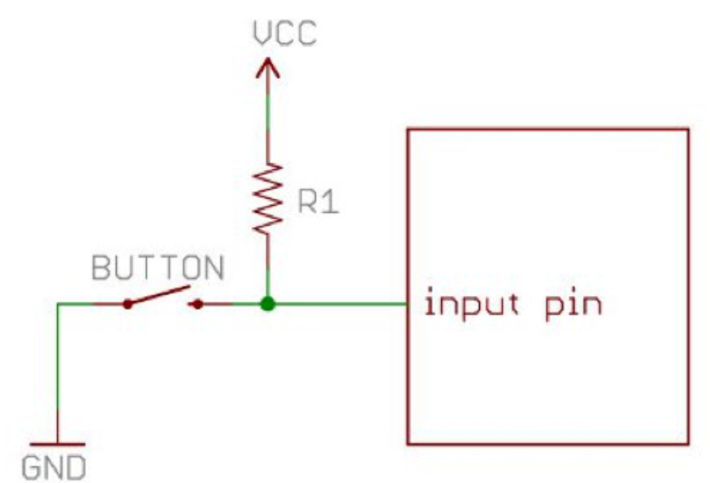
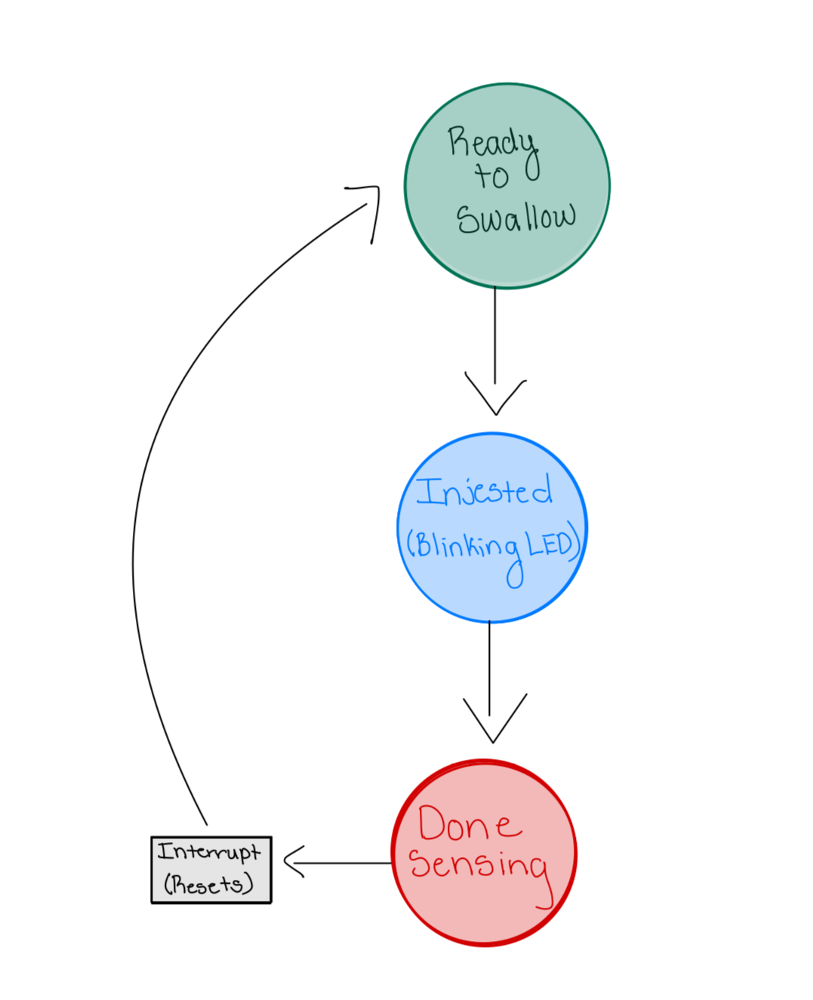
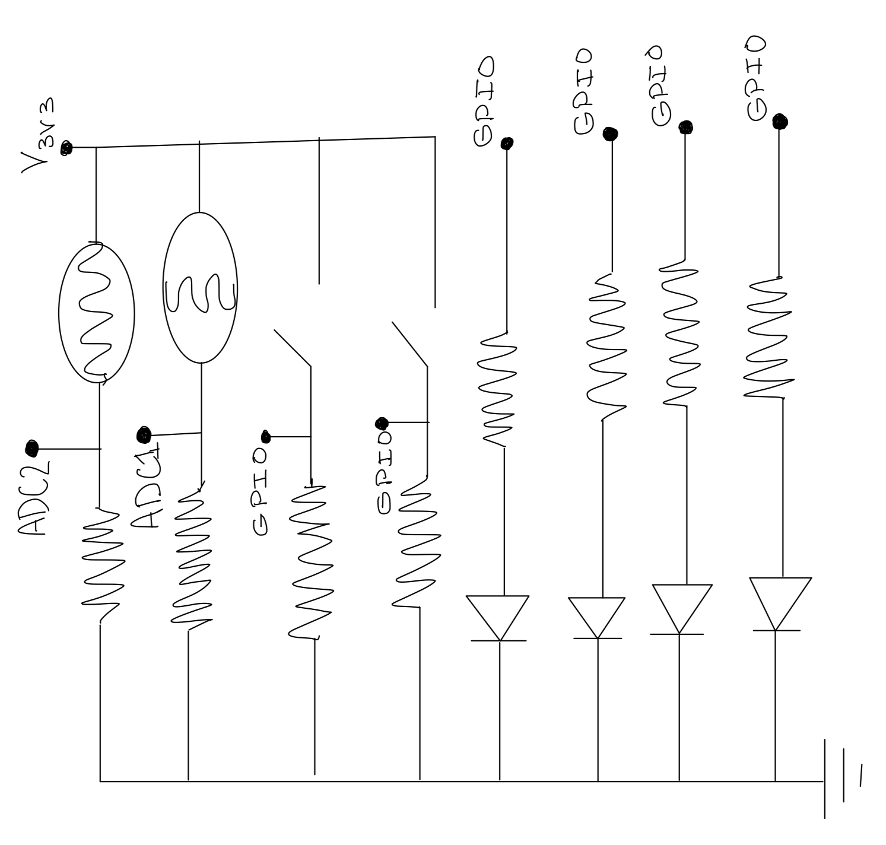
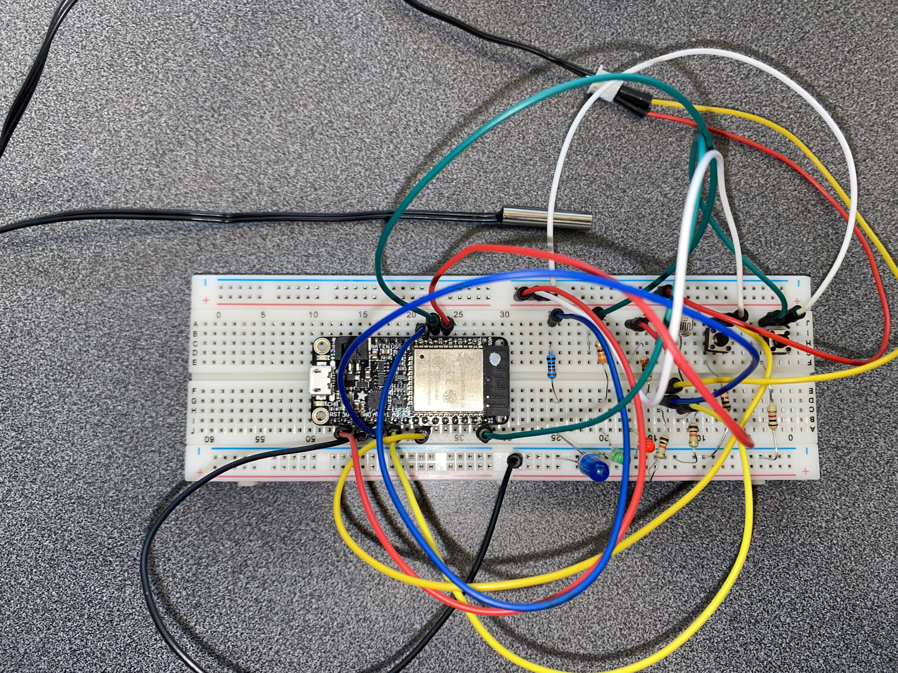
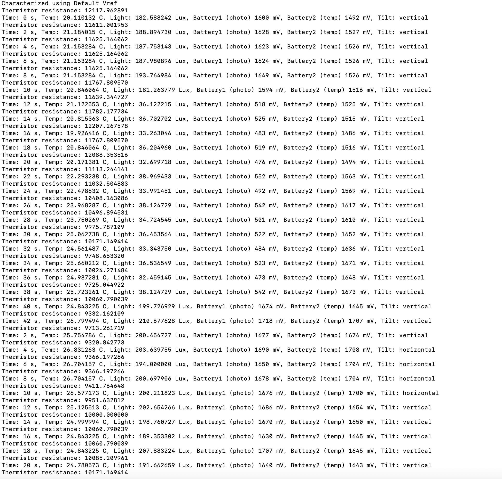

# SmartPill Ingestible Sensor

Authors: Leyandra Burke, Suhani Mitra, Margherita Piana, Kyla Wilson

Date: 2024-09-20

### Summary

This quest invovled creating an 'ingestible' smart pill with supporting diagnostic functions. Our smart pill senses the temperature in celcius, reprots light levels in lux, reports battery level, identifies tilt (horizontal/vertical), and indicates the status of sensing on 3 LEDs. A green LED indicates being ready to swallow, a blue LED blinks every 2 seconds to indicate that it is sensing, and a red LED indicates that the data has been processed.

We report our data every 2 seconds.

### Solution Design

To build our solution, we started by putting together the circuit and code for the photocell and the thermistor. The following pictures show how both parts are connected to the ESP32. The thermistor and photocell recieve voltage from the ESP32 and are connected to ADC channels. We used two different ADC channels, one for the photocell and one for the thermistor to get accurate values. In both skills we recieved the the raw ADC data and converted them to resistance values. We then combined the code used in both skills and began testing and refining the attenuation value. 

    

        
        
        
    

    

        Voltage Divider Circuits for Photocell and Thermistor
    
 

Once those were working together we added in the tilt sensor with its corresponding circuit. For the tilt sensor we used a button that outputs logical information if its pressed or not which we used to determine if it was horizpntal or vertical. The button also recieves voltage from the ESP32 and is conected to a GPIO pin as seen in the image below. 

    

         
    

    

        Simple Button Circuit 
    
 

 After the tilt we could then move on to the LEDs. We wired the LED to GPIO pins and wrote code so that the green LED, blue LED, and red LED lights up at specific points of the "injesting" process. The green LED lights up when the pill is ready to swallow. Once you cover the light, as if the pill is being swallowed, the blue LED turns on and blinks while it is sensing data. The red LED then turns on once the photocell detects light again and is out of the body indicating that all internal data is recorded. We were then able to add a hardware interrupt by coding the program so that once the button is pressed the injestible pill would go back to the initial state and the LED turns green again. Below is a flow diagram of what is happening as the program runs, a full schematic of our circuit, and a picture of the circuit put together.

    

        
        
    

    

        Flow Chart and Full Circuit Diagram
    
 

Our Smart Pill Circuit

### Quest Summary

The results of our injestible sensor were clear and accurate. The thermistor calculations got values ranging between 20 and 26 degrees celcius, which is relatively accurate for the environments where it was tested. The thermistor values also increased and decreased based on if someone was holding it or not. The photocell also produced correct values as it was around 100-130 Lux in fluorescent lighting and then as the photocell was covered the Lux value decreased. After each press the tilt button would change the orientation between vertical and horizontal. The battery level stayed fairly consistent based on the readings and the LED's changed at their specific timing. Since there were not any specified details on how the injestible pill should act prior to being swallowed and after leaving the body we made the assumption that the sensors will always be sensing. So if the device was powered on, or in this case when the ESP32 is flashed, all the sensors begin collecting data and the timer starts. Overall, each component of the injestible sensor worked to its best ability as shown in the image below. 

Terminal Output for Quest 1

We didn't run into any major setbacks while creating our smart pill. Since we had mastered each function of the smart pill individually through skills 07-12, it was just a matter of wiring them up in unison with one another. We did, however, run into one challenge where our idf.py kept throwing a CMake error. We tried many solutions through our software — switching laptops, cleaning our directories, etc — but were met with no fix. We eventually realized that pin 12 on the esp cannot be occupied by the button and had to rewire our circuit accordingly. 

In the future, to aid with challenges like the one above, we can look into using precut wires instead of jumper wires. This will give our circuit a much cleaner front and allow us to idenitify faults in our wiring, saving lots of time while debugging. As our projects become more and more invovled, this will ensure that we stay organized in terms of each element/function of our overarching project.

### Supporting Artifacts

- [Link to video technical presentation](https://drive.google.com/file/d/1ZTNs7x3-XwDqJ7dD9fJJPuMawC5AaltB/view?usp=share_link).
- [Link to video demo](https://drive.google.com/file/d/1qT0uw82gbCR9Di3h9_yrgwtbksK76Cw7/view?usp=share_link).

### Self-Assessment 

| Objective Criterion | Rating | Max Value  | 
|---------------------------------------------|:-----------:|:---------:|
| Objective One | 1 |  1     | 
| Objective Two | 1 |  1     | 
| Objective Three | 1 |  1     | 
| Objective Four | 1 |  1     | 
| Objective Five | 1 |  1     | 
| Objective Six | 1 |  1     | 
| Objective Seven | 1 |  1     | 

### AI and Open Source Code Assertions

- We have documented in our code readme.md and in our code any software that we have adopted from elsewhere
- We used AI for coding and this is documented in our code as indicated by comments "AI generated" 

