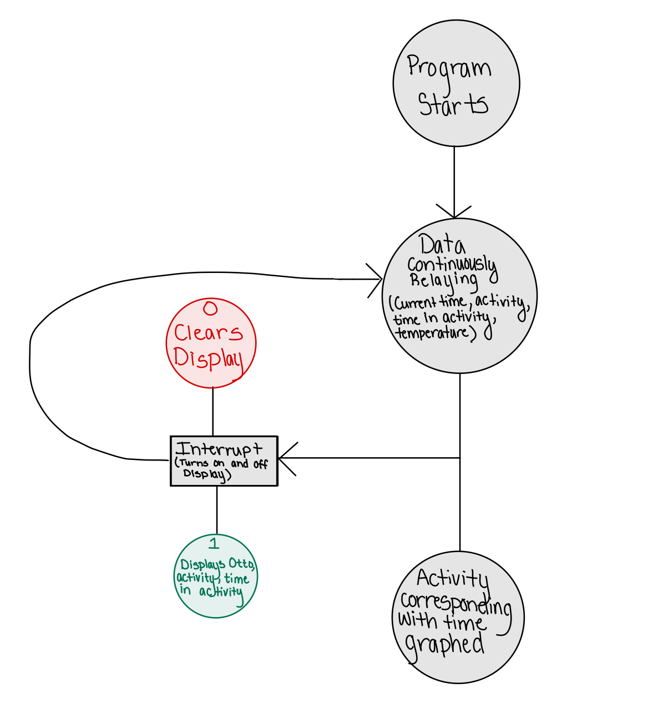
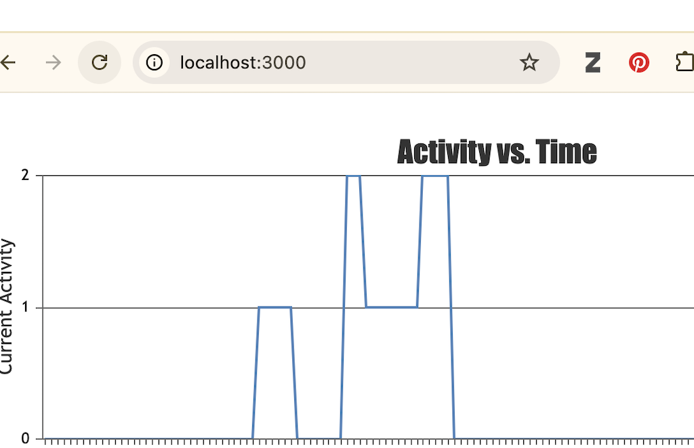
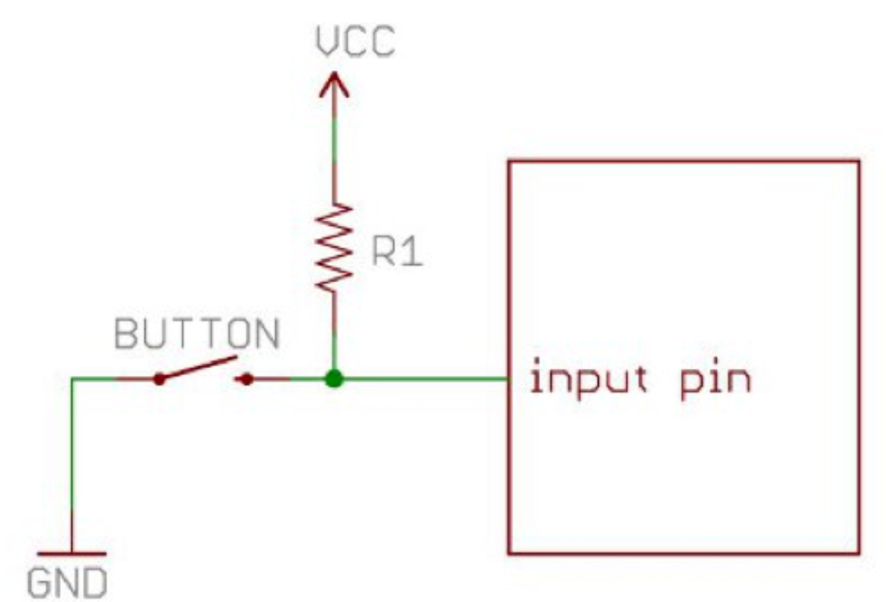
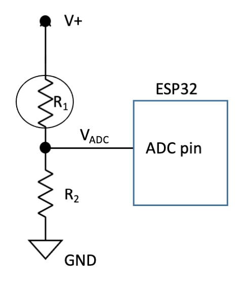
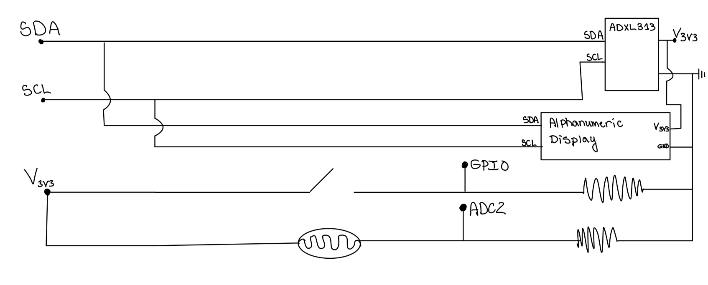

# CatTrack

Authors: Leyandra Burke, Suhani Mitra, Margherita Piana, Kyla Wilson

Date: 2024-10-04

### Summary

This quest involved creating a real-time cat collar monitor. This monitor intends to keep real-time statuses of the cat's movement, temperature, and time in the state. To do this, we first wired our circuit with the necessary hardware components. We used an ADXL343 to measure acceleration, a 4-prong button, an alphanumeric display, and a thermistor. We compiled the smaller circuits that we built in the skils into a larger overarching circuit for this cat collar.

### Solution Design

For a clear understanding a flow chart of how the device works is shown below. 

Device Flow Chart 

To measure our cat's acceleration, we used an ADAXL343 accelerometer. We connected the SCL and SDA pins to the respective SCL and SDA pins on the ESP32. To read acceleration, we had to utilize the ADAXL343's I2C bus. First, we initialize I2C communication and scan for devices, ensuring we have reached the correct ADXL343 accelerometer. We then read the data in, one byte at a time. We use the one-byte read to create a larger 2-byte register read which allows us to get real-time acceleration data in the X, Y, and Z axes. From these readings, we calculate roll and pitch by, for roll, taking the arctangent of (y/z) and multiplying by a scaling factor of 57.3. For pitch, we took the arctangent of ((-x)/sqrt(y * y + z * z)) * 57.3. We continuously poll for this data to receive accurate, real-time acceleration values of the cat.

We classified the cat's activity based on the acceleration values in 3 states: Inactive, Active, and Highly Active. We demarcated these states based on the roll and pitch — when the roll or pitch was greater than 10, we marked the cat as highly active. Otherwise, when there was a bit of roll and pitch, for values between -1 & 1, we marked that the cat was inactive. If none of these, the cat is active. We ran movement tests of our circuit to determine these values by shaking the circuit at various rates. Once we gathered sufficient data, we used these numbers to guide our classification.

To graphically display our data, we utilized a node app. Our node.js server is responsible for reading the ESP23's UART data through a serial port (we imported this package). We then send the received data to a browser via a WebSocket connection using socket.io. On the front end, the client's browser will receive data through this WebSocket connection at a local port and process it in real time using CanvasJS. We do this by parsing the incoming time and activity enumeration and updating the chart with these new data points using CanvasJS's dataPoints.push() and chart.render() methods in our index.html file. We plotted our data as activity status versus time, where 0 indicated inactivity, 1 indicated activity, and 2 indicated high activity. The graph below shows what this looks like.

Our Demo Graph

Alphanumeric Display, Displaying "Otto"

In terms of the display, we used an alphanumeric display. We connected the SCL/SDA pins in accordance with the ESP32's SCL/SDA pins. We had to use the I2C bus for this as well, which again involved initializing the connection and ensuring the correct address. From this, we were able to light segments of the display we needed.
We aimed to display three aspects of the cat's state: its name, its activity state, and the time it has been in this state. We utilized the sevensegfont table encoding to program "OTTO" as the name. We printed a string out based on the activity state: "aslp" for inactive, "actv" for active, "hact" for highly active. We concatenated this string onto the end of the "OTTO" string. Finally, we concatenated the respective string for the activity time in seconds based on what state the cat was in. We wanted to display this string in a scrolling fashion. To do so, we used a similar technique as we did in our first skill in this quest. We looped through 4 characters of the string to display and incremented our offset each iteration. 

For our button trigger, we utilized a 4-prong button. We wired this into the circuit as done in previous skills/quests, by including a resistor and attaching it to a general GPIO pin on the ESP32. In terms of the software we used, we utilized the button hardware interrupt. To do this, we first initialized the button as a GPIO input, then had a button state flag that toggled when the button was pressed. This allowed us to control our display with the press of a button. Essentially, our display would turn on with the press of the button, scroll through the cat's current state, and subsequently turn off when the button is pressed again.

Button Circuit 

To measure temperature, we used a thermistor. As done in previous skills/quests, we used an ADC channel to read the raw voltage at the thermistor. Using this, we calculated the thermistor resistance. Once we obtained this, we used the Steinhart-hart equation to convert to Kelvin and subsequently to Celcius.

Thermistor Circuit 

To measure time, we incremented a counter each time we ran through our main task, test_adxl343, which was executed every 1 second. Each time test_adcl was executed, we would re-evaluate Otto's state using the classifyActivity function. We used the roll and pitch from the accelerometer to determine what Otto's state was: inactive ("aslp"), active ("actv"), or highly active ("hact"). If the state Otto was in 1 second ago did not match his current state, then we would reset the activity counter. When we wanted to display the time in activity on the alphanumeric display, we ran into issues keeping timing because we were using a 1 second delay for the alphanumeric's scroll. To avoid this problem, we had to increment the time counter in the display_info function when the button state was high, and then have test_adxl343 pick up where display_info had left off when the button state returned to 0.

We measured the overall time from startup using the task delay as well, we just simply did not reset the count when the states changed. It is printed next to CurrentTime in the console. For the current time from startup we used the time.h library to display the local time from the device the program is being executed from. Since the ESP32 is not connected to internet it believes that the local time is 00:00:00 therefore the current time is set as the time from startup.

In our code, we have each of these aspects of the CatTrack collar in independent functions. This enabled us to easily debug and identify errors. 

Circuit Schematic

Our Circuit

### Quest Summary
Our results were accurate. We succesfully monitored the cat's movement, classified its activity status, and reported this both on the display and through a node app (and client browser). Nevertheless, we encountered some challenges. One of the challenges we encountered was the node and canva js integration. In the beginning we had trouble reading the right data from the esp32 since we were printing everything in different lines. Therefore, once we adjusted that and we selected the right method to divide our data we were able to make node and canva js work as expected. Another challenge that we encountered was the time. We were able to make the time work but once we tried to display it on the alphanumeric display it would not work. The time on the alphanumeric display was going slower than the actual time due to the delays in both the original task and the delay in the display_info function so there was enough time to see the letters when scrolling. After debugging, we were able to make it work by placing the finction where the timer was counting in the display_info function. Overall we are happy with how this quest turned out, however one improvement to our design would be integrating the entire circuit on one breadboard so that it would be easier to test and carry our project. 

### Supporting Artifacts
- [Link to video technical presentation](https://drive.google.com/file/d/1QxcgyCxrPKjAr8rUF2vTt3wfB44idKpH/view?usp=share_link).
- [Link to video demo](https://drive.google.com/file/d/1aeG4XfRDbeEeDhbc3g0gp9Uj2DbB5lx0/view?usp=sharing).

### Self-Assessment 

| Objective Criterion | Rating | Max Value  | 
|---------------------------------------------|:-----------:|:---------:|
| Objective One | 1 |  1     | 
| Objective Two | 1 |  1     | 
| Objective Three | 1 |  1     | 
| Objective Four | 1 |  1     | 
| Objective Five | 1 |  1     | 
| Objective Six | 1 |  1     | 
| Objective Seven | 1 |  1     | 

### AI and Open Source Code Assertions

- We have documented in our code readme.md and in our code any software that we have adopted from elsewhere
- We used AI for coding and this is documented in our code as indicated by comments "AI generated" 
