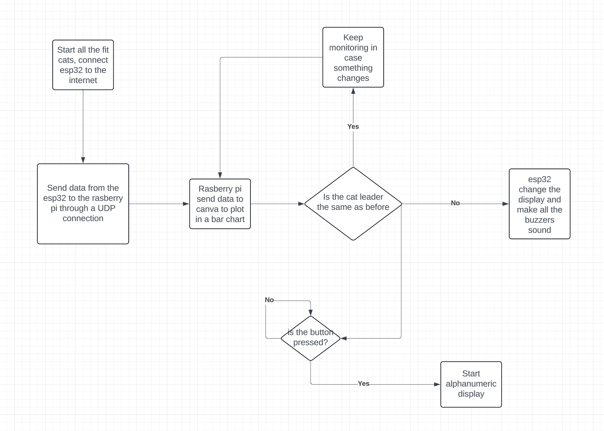
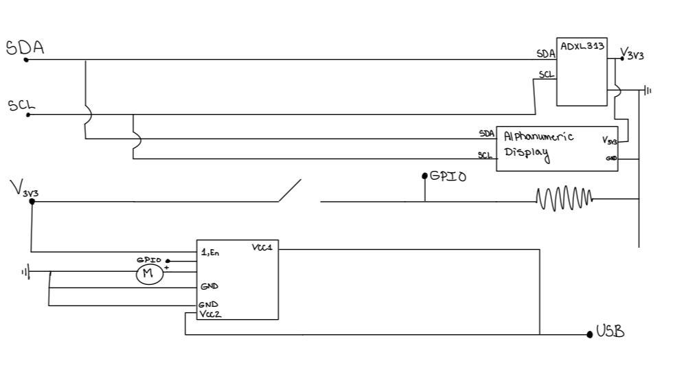
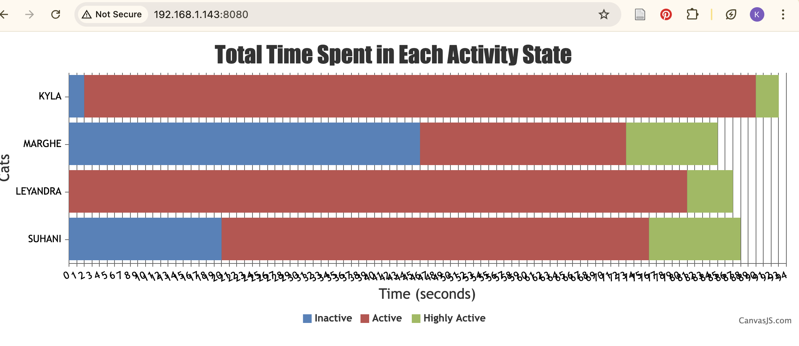

# Quest Name

Authors: Leyandra Burke, Suhani Mitra, Margherita Piana, Kyla Wilson

Date: 2024-10-24

### Summary

This quest invovled making a live fit cat tracker. We wanted live tracking of our 4 team member's cats and wanted to identify which cat was in the lead in a digestible interface. To do so, our main focus was to get our independent componenets connected through a router. Our router uses a dynamic DNS. We then have our 4 cat track collars (same circuit and programming as the previous skill, just 4 iterations of this) which send data to a server. We hosted our server through a node app on a Raspberry Pi which was also connecte to our router. Using the data we gathered from the ESP32s, we used CanvasJS to display our cat leaderboard which is accessible on open Internet. We also had the leader data sent back to the ESP32s such that we could display which cat was in the lead on each collar's local display, as well as have all cat's buzzer toggle on to indicate a leader change. We also supported Webcam sourcing video from pi-cam into a window on the client machine. We used VLC to do so and used the correct (Pi's) IP address and port. Much of these processes invovled utilizing the correct IP address and port number, as well as performing accurate port forwarding throught the Tomato router interface.

### Solution Design

Software Diagram

We used an alphanumeric display to display the leader on each cat's "collar". We connected the SCL/SDA pins of the alphanumeric display to the ESP32's SCL/SDA pins. We would take the message sent from the UDP server to the UDP client and display the corresponding leader on the collar and buzz all of the cats' collars when the leader changed. The leader is determined by iteration through each of the connected cats and choosing the cat with the most active seconds overall (active time + highly active time). We accomplished notifying of the leader change by using socket.io and emitting the leader (in string format) to the connected clients (in this case the cats' collars). If the current leader did not match the previous leader (determined by the ESP32s), we would change the text displayed on the collar to say the name of the new leader. We used our approach from our previous skills and previous quest to actually populate the alphanumeric display via I2C. 

To indicate leader change, we wired in a buzzer using the LD293D driver as seen in the circuit below. All ESP's buzzers turned on for 3 seconds when a leader changed. We used semaphores to mitigate corrpution so only the correct thread could access this process at a time (we ran into issues where buzzers weren't toggling correctly). 

Buzzer Circuit

Circuit Schematic

Our Circuit

Similarly to our last quest, we used the accelerometer to gauge our cats' activity levels. We used the same thresholds as we did in Quest 2:

**State 0 (Inactive) :** if (roll > -5 && roll < 2) && (pitch > -3 && pitch < 3)

**State 1 (Active) :** else (i.e. not in State 0 or State 2)

**State 2 (Highly Active) :** if (roll > 10 || pitch > 10)

In this quest, we added in the Raspberry Pi to host the UDP server rather than using our laptops as we did in the previous quests. We had the UDP clients (esp32s) send their activity data via the router (they were all connected through the WiFi) to the UDP server, which then parsed the information and displayed it at the address 198.162.1.143:8080. This is the Pi's IP. We used a bar chart to display to the user Inactive time, Active time, and Highly Active time for each cat (Leyandra, Suhani, Marghe, and Kyla). We used CanvasJS to format this in an index.html file and integrated this in with our node server that we ran on the Pi. This node server received data from all 4 ESPs and determined who the leader was. The server then sent this data back to the ESPs to allow the individual cats to display who the leader was/toggle their buzzer if necessary.

We had a button which when pressed would enable the alphanumeric display to show the current leader. We also had a camera to track the cats. To access this, we used VLC on our local machine and connected to the Pi's IP. On the Pi, we started the camera which allowed us to view live video feed on our laptops.

Leaderboard Example

### Quest Summary

We intially had trouble making the esp32 and the raspberry pi communicate. To solve this issue we started with a very simple node code and double checked that the Ip was correst, we did the same with the esp32 code. We then realized that one of our issues was that our esp32 was not connecting to the internet, so we went back to the wifi skill and we looked at that code to fix ours. Once we were able to send data to the Raspberry pi we started modifying the node code to make it so that it would send back to the esp32 who the leader was, based on what our bar chart on canvas said. Once we had that working, we focused on the buzzer. Out issue was that the buzzer would not buzz every time the leader changed. Therefore we started debugging and double checking our circiut. After some trial and error we were able to make it work. Overall our results after fixing these issues were accurate as expected, sending and receiving data between diffeent devices and using that data to track who is in the lead. 

### Supporting Artifacts
- [Link to video technical presentation](https://drive.google.com/file/d/1c1fob2X5CDWqEljxFNqP4luyKVzrHigC/view?usp=share_link). Not to exceed 120s
- [Link to video demo](https://drive.google.com/file/d/15GPqPpSRHCXLkspBWqFU_9S2aindpf9t/view?usp=share_link). Not to exceed 120s

### Self-Assessment 

| Objective Criterion | Rating | Max Value  | 
|---------------------------------------------|:-----------:|:---------:|
| Objective One | 1 |  1     | 
| Objective Two | 1 |  1     | 
| Objective Three | 1 |  1     | 
| Objective Four | 1 |  1     | 
| Objective Five | 1 |  1     | 
| Objective Six | 1 |  1     | 
| Objective Seven | 1 |  1     | 

### AI and Open Source Code Assertions

- We have documented in our code readme.md and in our code any software that we have adopted from elsewhere
- We used AI for coding and this is documented in our code as indicated by comments "AI generated" 

