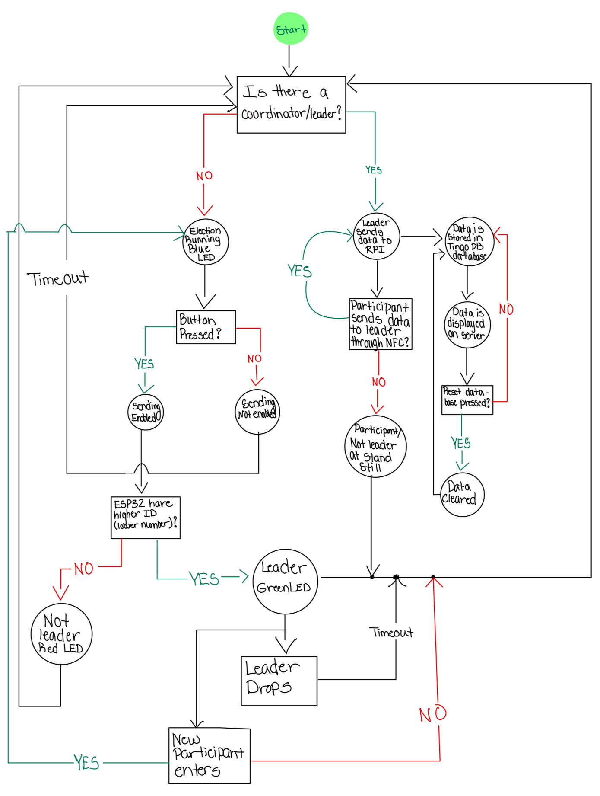
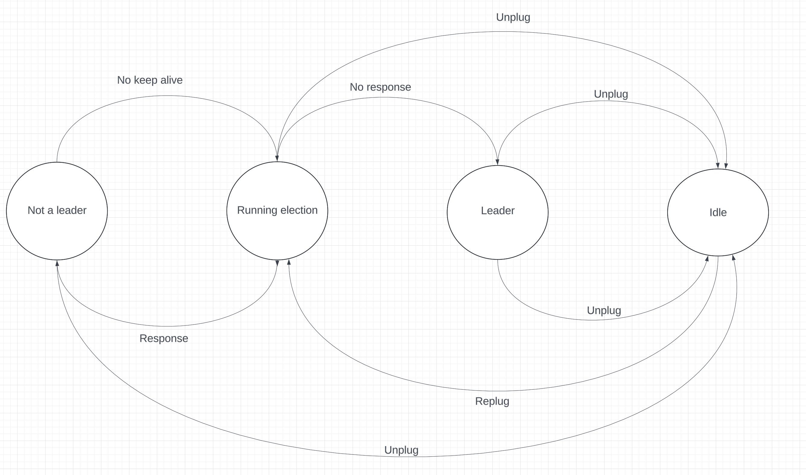
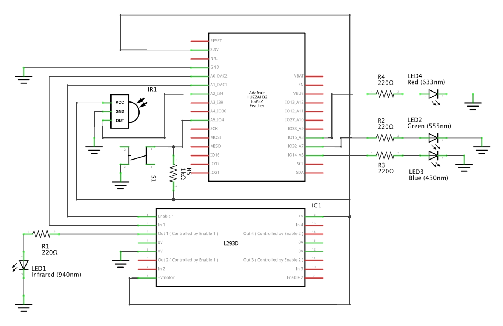
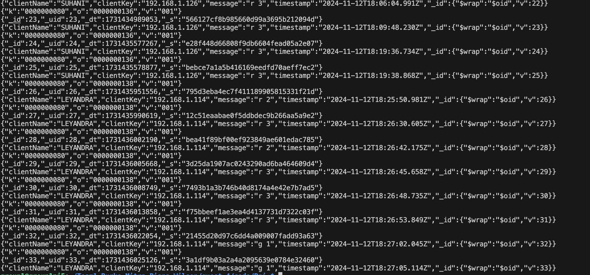
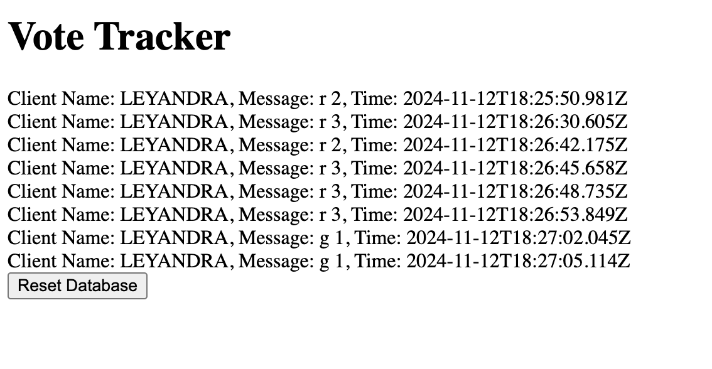

F# Secure E-Voting

Authors: Leyandra Burke, Suhani Mitra, Margherita Piana, Kyla Wilson

Date: 2024-11-12

### Summary

In this quest, we created an electronic voting system. We were able to simulate voting using NFC, UDP, WiFi, Node.js, ESP32, and HTML components. The system operates as a network of devices, fobs, that are used so participants have the ability to send and receive messages that have different functionalities. Each fob connects to the other through NFC with IR transmitters and recievers, which allows for votes to be casted between ESPs, compares and decides who has the lowest ID between the fobs that are communicating, and display its status of its operating state, such as leader, not a leader, or running election, with different colored LEDs. Whichever fob has the lowest number or higher ID, the leader, then sends the vote to the raspberry pi where the voting data is continuously stored in a database and displayed on a HTTP server.    

### Solution Design

For a clear understanding of how our system fully works below is a flow diagram.

System Flow Diagram

Our approach towards our solution began with creating a state machine diagram to understand how to manage the states of the voting process and the leader device. We were then able to build the state machine within our code based on this diagram.

Our State Diagram for One ESP32 Device

We were then able to build our circuits which included the following hardware parts. 

**Hardware**
- IR Transmitter LED
- IR Receiver
- H Bridge
- 3 LEDs (Red, Blue, Green)
- ESP32
- Raspberry Pi
- Button
- Resistors
- Power Source (Battery)
- Wifi Connection and Router

We used IR receiving and sending to create NFC (near-field communication) channels between the different fobs. The fobs used the NFC to cast votes. When the user pushes the button sending between IR transmitter and receiver is enabled for the fob that is sending. If any of the fobs had their sending enabled and held their IR transmitter up to the receiver of another fob, the fob would receive their vote, and either send it off to the leader, or if the receiving fob was the leader, then the leader would send the vote directly to the raspberry pi. Once the leader receives the vote, it will send an acknowledgement using UDP to the ESP who voted via NFC.

The H bridge used was a L293D. Its main purpose in this quest was to add modulation to the IR signal because the IR LED uses a higher amount of current than what can be provided with a GPIO pin from the ESP32. 

The RGB LEDs change based on the state of the fob. In our code, we created a task that switches between colors depending on the status. So if the participant is not the leader then their red LED is on, if there is an election in progress then the LED that is on is blue, and if they are the leader then their green LED is on. 

IR and LED Schematic

This quest also required us to use the router and a raspberry pi. The router served as a communication point for all the ESPs and the raspberry pi, as they are all connected through WiFi. The raspberry pi was used to host the UDP server and as a path to store the data in the database.

Our Circuit

Our software included the following.

**Software**
- ir-txrx.c, w/ associated dependencies and CMakeLists.txt files
- rasberry_receive.js
- prova.html

We used UDP to create communication channels between each of the ESPs, using the router as the hub. To do this, we created multiple functions to send messages out to other ESPs on the network. We had a function called send_message_single which took the message (char), the id of the sender (int), and the id of the recipient (int). We used this function to send answer messages, messages from the vote recipient to the leader, and the acknowledge message from the leader to the voter upon receipt. We also had a function called send_message which took the message (char) and the id of the sender (int) that would iterate through the list of ESPs and send them all the same message. We used this function to send election messages and victory messages which we wanted to send to all of the other esps. We created a task to receive messages from other ESP32s on the network. This task listened for messages from all of the ESP32s identified in our MEMBERS array of strings/char *. The task called a function process_received_message every time it received a message from another ESP32. This function has a case for each message type:

e - election

k - keep alive

r, g, b - votes to send to RPi

c - acknowledgement of vote from leader

a - answer (opposition)

v - victory

Then the function either sends a response message accordingly or does nothing. 

Within this state machine task we are also keeping track of if there is a timeout. We have two primary functions that deal with the election timeout and the coordinator timoeout. The election timeout is active in the ELECTION_RUNNING state. When we receive a new election message, we reset the election timeout. When the election timeout expires, we enter the election_timeout_handler which will evaluate whether or not we are the leader, and change the state to LEADER or NOT_LEADER accordingly. The coordinator (leader) timeout was used in a similar way. The timer itself was created in the same way as the election timeout with the xTaskCreate function. We then start the timer when we enter the NOT_LEADER state. Then, we reset the timer every time we receive a keep alive function. If the coordinator timer expires before we receive another keep alive function, then we will go into the coordinator_timer_handler function and change the state to ELECTION_RUNNING

On the raspberry pi using we use a UDP server that recieves messages from the ESP32 leader. Each of the messages recieved are then logged and saved to a TingoDB database. The data from the message is stored with a timestamp, the UDP client IP (the esp32 it is sent from), and the UDP client name. We also have an HTTP server being run on port 8080 which shows a visualization of the voting data from the leader ESP32s. This interface allows you to reset the database as well, with the click of a button.

Database

Voting Polls with Reset

### Quest Summary
A challenge for us was connecting the node server to the HTML file. We spent a lot of time debugging this, both in the node file as well as the html file. We ultimately realized this error was because we did not perform an app.get() call from the node to the html file. We found this by drawing from previous skills and isolating parts of our server that we were missing.

We also had trouble ensuring that our FOBs were sending the correct LED color. We addressed this by ensuring that when we received a vote (message r, g, or b) we sent the subsequent message to the leader with the id as the id from the message we read in, not the ID of the ESP that was offloading the message to the leader.

### Supporting Artifacts
- [Link to video technical presentation](https://drive.google.com/file/d/1xNL4Tx0lyM2k2AgjUw1658iJ-kNPcseO/view?usp=share_link). Not to exceed 120s
- [Link to video demo](https://drive.google.com/file/d/1-dHcb7RmbREfYFlAUwA5auuCVE0Cd_Bj/view?usp=share_link). Not to exceed 120s

### Self-Assessment 

| Objective Criterion | Rating | Max Value  | 
|---------------------------------------------|:-----------:|:---------:|
| Objective One | 1 |  1     | 
| Objective Two | 1 |  1     | 
| Objective Three | 1 |  1     | 
| Objective Four | 1 |  1     | 
| Objective Five | 1 |  1     | 
| Objective Six | 1 |  1     | 
| Objective Seven | 1 |  1     | 

### AI and Open Source Code Assertions

- We have documented in our code readme.md and in our code any software that we have adopted from elsewhere
- We used AI for coding and this is documented in our code as indicated by comments "AI generated" 

