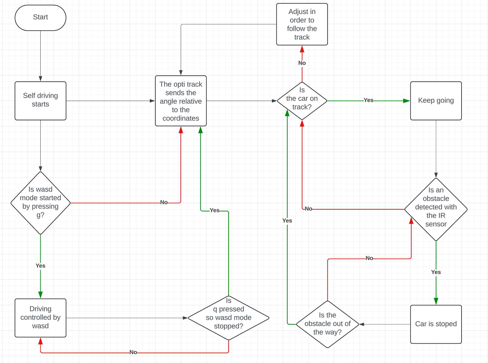
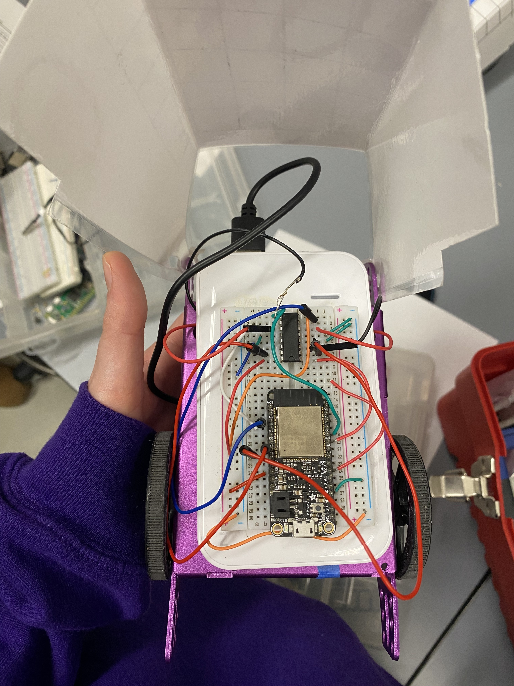
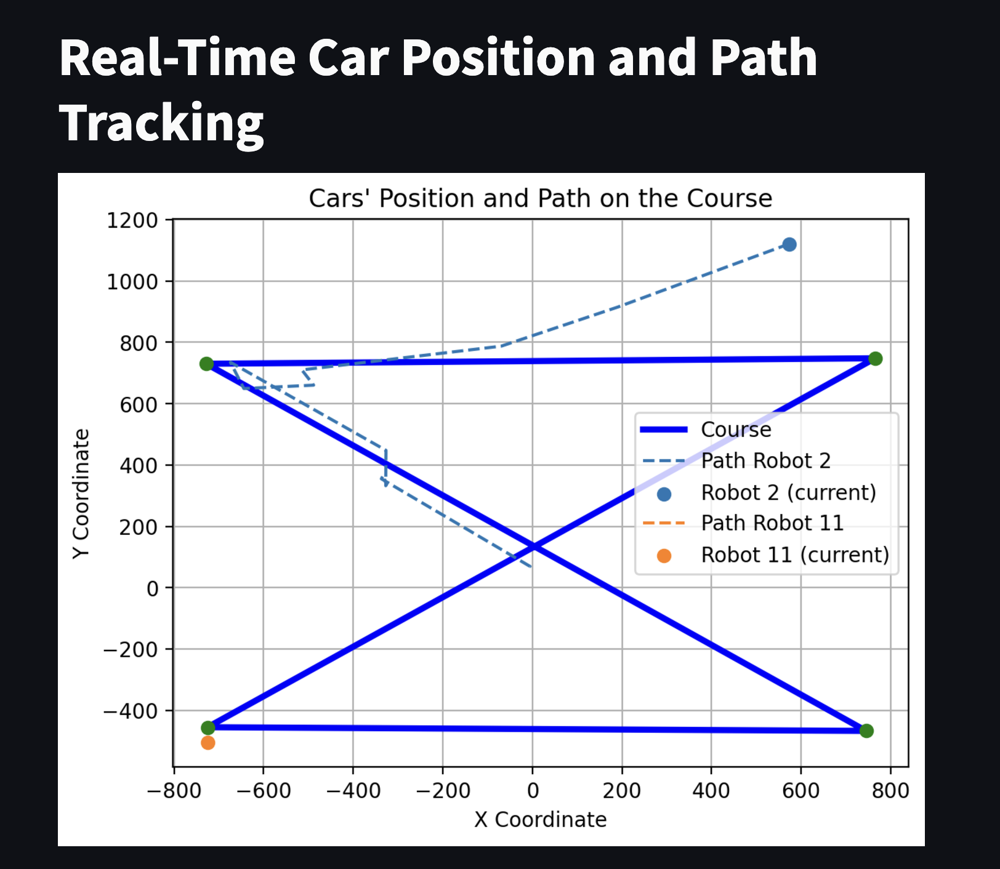
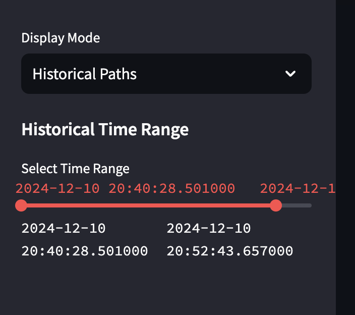

# Personal Indoor Robot Assistant

Authors: Leyandra Burke, Suhani Mitra, Margherita Piana, Kyla Wilson

Date: 2024-12-05

### Summary

For this quest, we were tasked with enabling our two "purple cars" to traverse a set path simultaneously without colliding with one another. This involved pinging the Optitrack node.js serve for live coordinate data of our cars, creating a local WASD remote control, and integrating an IR sensor. Once we obtained the live coordinate data, we had to ensure the car correctly moved from waypoint A to waypoint B with the correct direction and magnitude. When the car isn't in WASD-mode, we enable self-driving which will automatically traverse the course. Finally, if an obstacle comes in the way of our car, it will stop movement.

### Solution Design

We started by putting together all the code by using the wasd code as our base. We then added the opti track code and the sensor code. For our sensor we decided to utilize the IR sensor from the skil cluser for this quest. We decided to use the IR sensor instead than the ultrasonic sensor for many reasons. Mainly because it has a better response time, and since we need it to avoide collisions, we thought this was an important thing to consider. Moreover IR sensors have a better short range detection, which is another quality needed for the purpose of our sensor. We decided to put our sensor in the front of the car assuming that each car will have one so we did not need one in the back since the one behind it should theoretically use it's fron sensor to stop its own movement. 

Here is the logic for our software:

Our Software Flow Chart

We have a node.js client for sending WASD data to the ESP. We added in 'g' key to toggle WASD mode and a 'q' key to quit this mode. When the car is not in WASD mode, we add in automonous self driving by using the coordinate waypoints from the Optitrack. The ESP has a UDP server to intake data from node and determine what mode to be in. 

To do the waypoint traversal, we started out by creating a struct called waypoint that would hold the x coordinate, z coordinate, and the next waypoint. Then, in our self_drive task we initialize the waypoints. The interior loop in self_drive checks the distance sensor to see if there is any object too close, if so then stop, if not then call the function calcroute. Within calcroute, we do the angle calculation to get to the next waypoint. To do this calculation we took the difference between the the x value of the waypoint and the x value of the current position of the car and took the difference between the z value of the waypoint and the z value of the car. Once we had these, we used the atan2f() function to calculate the angle relative to x axis of the coordinate system. From here, we converted the value to degrees and took the absolute value. Then, for each quadrant, we did a different transformation on the angle to convert it to the same system that the optitrack uses. From here we were able to take the difference between the angle optitrack provided and the angle we calculated based on the current position and the destination. With this value, we then call the turn function. At first, we tried to turn left or right depending on the sign of the angle difference, but found it worked better when we consistently turned one way. In the turn function, if we were within 15 degrees of the angle we needed, then we would start to move forward, else we would turn.

Within all forms of driving, if the car sensed an obstacle with 30 cm of the sensor (placed at the front of the car), we halted all movement. Once the obstacle was gone, we started movement again.

Our Circuit

For streamlit documentation, we utilized node.js to first ping the Optitrack server for live coordinate data. Once we obtained this, we parsed the data and formatted it into a json file. This allowed our sttreamlit plotting file (plot.py) to load this data. In this streamlit plotting code, we also defiend the waypoints of the course and displayed this. Atop this, we superimposed the actual robot path in two modes — real time tracking and historical tracking. This allows us to more accurately visualze the path our car takes.
So, our streamlit module uses a 2D grid representation to show live, real time tracking of both of our robots. It also displays historical tracks over a selected time period, all done through the TingoDB data storage system and by pinging the Optitrack server.

Streamlit Interface

Historical Tracking Toggle

### Quest Summary

In all, our code functions as we expect. To test our code we actually started by getting the IR sensor to work, we encountered some issues initially with the formula that we were using. After ome trial and error we were able to get the result we expected. We then moved into making the wasd remote control work. We wanted our car to drive autonomously until "g" was pressed, then wasd start. To stop wasd and return to autonomous control "q" can be pressed. We encountered many issues initally because the esp was not receiving from node. After some debugging we relized that the issue was that the IP address of the esp32 changed since the wifi we were using now was different than the one we used for the skill. Once we obtained the new IP address, wasd was working. We had a lot of issues with our motors, and when we switched our car to another team's and changed their wiring to our wiring, the car worked just fine, which was very frustrating!

### Supporting Artifacts
- [Link to video technical presentation](https://drive.google.com/file/d/1aWtSzqjSOVijXc-auXgHeNYn8-F5NmoI/view?usp=sharing). Not to exceed 120s
- [Link to autodrive video demo](https://drive.google.com/file/d/1IDT73tNCH9le6fkun2Of-IsPFg4nViL9/view?usp=sharing). Not to exceed 120s
- [Link to WASD video demo](https://drive.google.com/file/d/1oj-hsrlGa4i16gUzgER_KBqqliMXvYKe/view?usp=sharing). Not to exceed 120s
- [Link to streamlit video demo](https://drive.google.com/file/d/1WpCgQcm4SRRQl6zmFKR1D9NLMHYMXqvs/view?usp=drive_link). Not to exceed 120s

### Self-Assessment 

| Objective Criterion | Rating | Max Value  | 
|---------------------------------------------|:-----------:|:---------:|
| Objective One | 1 |  1     | 
| Objective Two | 1 |  1     | 
| Objective Three | 1 |  1     | 
| Objective Four | 1 |  1     | 
| Objective Five | 1 |  1     | 
| Objective Six | 1 |  1     | 
| Objective Seven | 1 |  1     | 

### AI and Open Source Code Assertions

- We have documented in our code readme.md and in our code any software that we have adopted from elsewhere
- We used AI for coding and this is documented in our code as indicated by comments "AI generated" 

